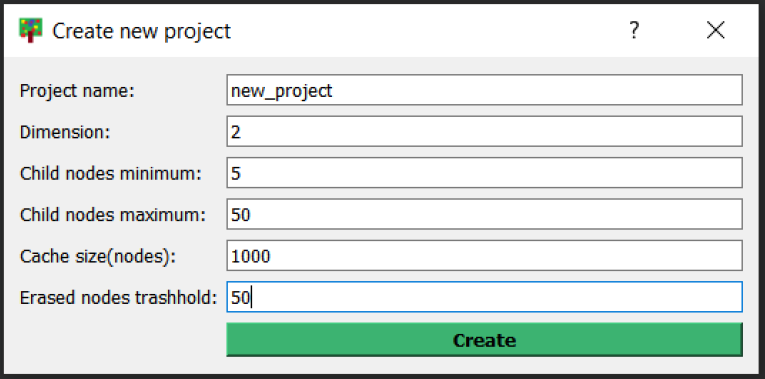
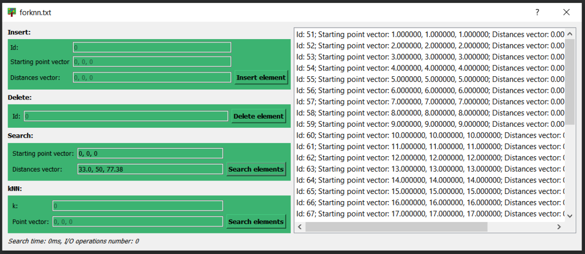
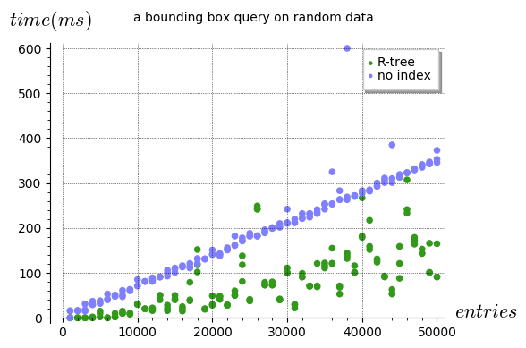
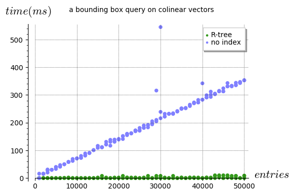
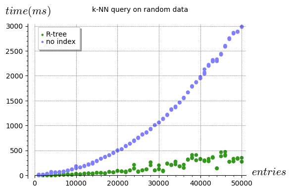
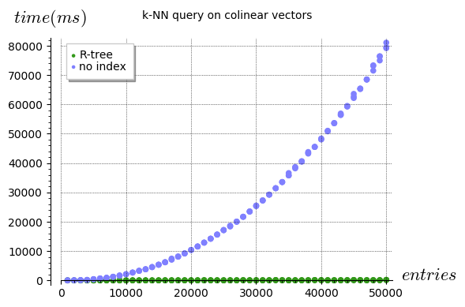

# R-tree

Implementation of the <a href="https://en.wikipedia.org/wiki/R-tree" title="R-tree">R-tree</a> - data structure appropriate for indexing multi-dimensional data in form of hyperrectangles. This project additionally provides a simple GUI allowing to transform the structure, save it and analyze results of the queries:

### Experiments prove the efficiency of the R-tree

- bounding box query

  
  

- k-NN query

  
  

